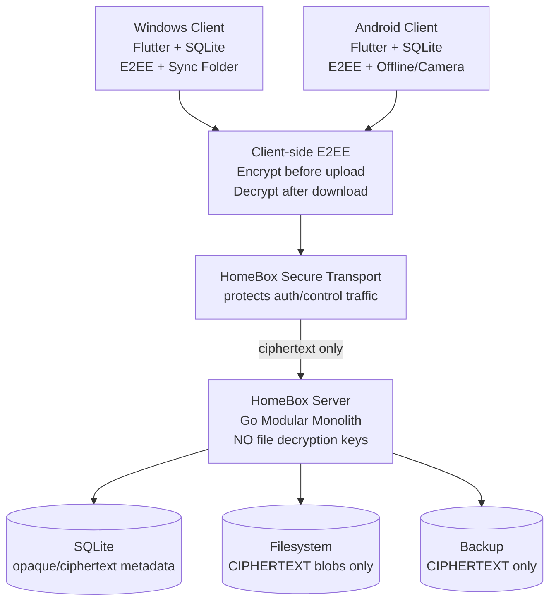
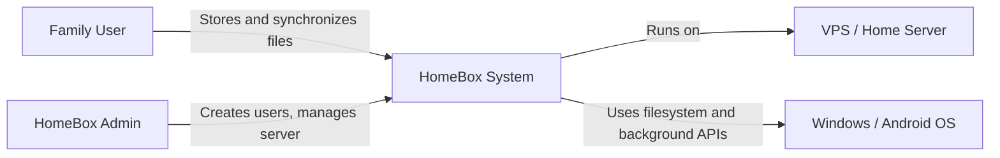
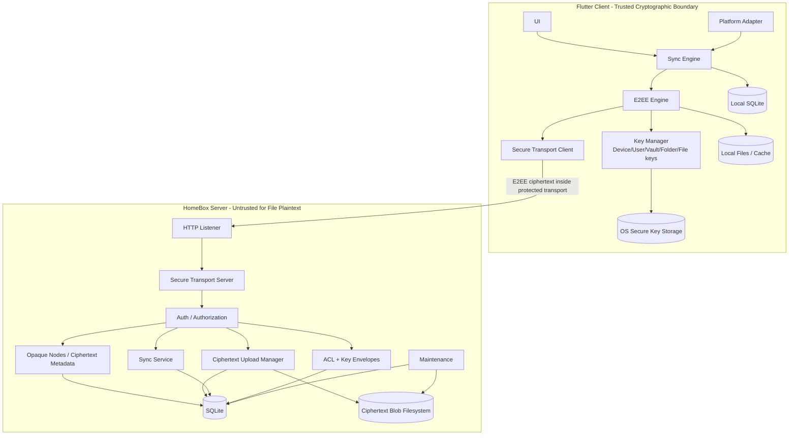

# HomeBox — Software Specification & Development Roadmap

**Версия:** 1.2  
**Изменение v1.2:** обязательное client-side E2EE: сервер/VPS никогда не получает ключи расшифрования файлов и не видит plaintext содержимого.  
**Статус:** Draft for implementation  
**Тип продукта:** self-hosted домашнее файловое облако / упрощённый Dropbox  
**Целевые платформы:** Windows 11, Android  
**Сервер:** Go + SQLite + filesystem  
**Клиент:** Flutter + SQLite  
**Максимум пользователей:** 5  
**Ориентир по устройствам:** до 30  
**Максимальный размер файла:** 100 MB  

---

## 1. Назначение документа

Этот документ является рабочей спецификацией HomeBox и дорожной картой реализации. Он переводит исходный продуктовый промпт в набор архитектурных решений, функциональных требований, интерфейсов, моделей данных, протоколов синхронизации, критериев приёмки и этапов разработки.

Документ должен использоваться как единая точка согласования для:

- архитектуры;
- backend-разработки;
- Flutter-разработки;
- sync engine;
- криптографического transport layer;
- DevOps;
- QA;
- релизов.

Главный принцип проекта:

> **Simple enough for a home server, reliable enough to trust with family files.**

---

# 2. Product Scope

## 2.1. Цель

HomeBox — небольшое self-hosted приложение для хранения и синхронизации файлов между устройствами членов семьи.

Система должна позволять пользователю:

- хранить файлы и папки на своём сервере;
- синхронизировать изменения между Windows и Android;
- работать offline;
- автоматически продолжать синхронизацию после восстановления сети;
- безопасно разрешать конфликты без потери пользовательских данных;
- делиться файлами и папками с другими пользователями HomeBox;
- использовать общую семейную папку;
- хранить версии файлов;
- восстанавливать удалённые файлы;
- автоматически загружать фото и видео с Android;
- разворачивать сервер дома, на NAS, mini-PC или VPS.

## 2.2. Основные ограничения

| Параметр | Значение |
|---|---|
| Пользователи | максимум 5 |
| Устройства | ориентировочно до 30 |
| Максимальный размер одного файла | 100 MB plaintext до шифрования |
| Основная desktop ОС | Windows 11 |
| Основная mobile ОС | Android |
| Серверная БД | SQLite |
| Binary storage | filesystem, ciphertext only |
| Backend | Go |
| Client | Flutter |
| Клиентская БД | SQLite |
| Работа без сети | обязательна |
| HTTP без TLS | поддерживается |
| Шифрование HomeBox payload поверх HTTP | обязательно |
| Client-side E2EE файлов | обязательно |
| Наличие file-decryption keys на сервере/VPS | запрещено |
| Plaintext пользовательского файла на VPS | запрещён, включая temp/cache/backup |

Критическое требование:

> **HomeBox Server является zero-knowledge storage для содержимого файлов: он хранит и синхронизирует только ciphertext и техническую metadata, необходимую для работы сервиса.**

## 2.3. Не входит в MVP

В MVP не реализуются:

- публичные ссылки на файлы;
- web-клиент;
- macOS/iOS/Linux клиенты;
- server-side полнотекстовый поиск содержимого файлов;
- server-side preview/thumbnail generation из plaintext;
- server-side antivirus/content inspection, требующие расшифрования файла;
- Office/WebDAV совместное редактирование;
- сложные enterprise ACL;
- SSO/LDAP/OIDC;
- S3/MinIO/Ceph;
- микросервисы;
- Kubernetes;
- Kafka/RabbitMQ;
- Redis;
- PostgreSQL;
- distributed filesystem.

E2EE является частью MVP и не может быть отключено в release-сборке. Серверная расшифровка файлов не является допустимым fallback.

Архитектура должна позволять добавить часть остальных возможностей позже без ослабления E2EE-модели.

# 3. Приоритеты продукта

При конфликте требований использовать следующий порядок:

1. отсутствие потери данных;
2. невозможность расшифровать пользовательские файлы на VPS/сервере;
3. целостность и аутентичность ciphertext;
4. восстановимое client-side управление ключами;
5. корректная синхронизация;
6. безопасность передачи;
7. восстановление после сбоев;
8. простота эксплуатации;
9. понятный UX;
10. производительность;
11. дополнительные функции.

Нельзя жертвовать E2EE или сохранностью данных ради дедупликации, server-side preview, поиска или более простого backend-кода.

# 4. Architecture Overview

## 4.1. Архитектурный стиль

HomeBox реализуется как modular monolith на сервере и cryptographic client на Windows/Android.

Сервер — один процесс Go:

```text
HomeBox Server
├── HTTP Listener
├── Secure Transport
├── Authentication
├── Authorization
├── Opaque Node Metadata
├── Ciphertext Blob Storage
├── Upload Manager
├── Sync Service
├── Encrypted Key Envelope Registry
├── Sharing ACL
├── Maintenance / GC
├── Backup / Restore
└── Observability
```

Сервер **не содержит File DEK, Vault Key, Folder Key, User Master Key или Recovery Key в расшифрованном виде** и не имеет API, позволяющего расшифровать file content.

Клиент Flutter содержит E2EE layer:

```text
Flutter Client
├── UI
├── Sync Engine
├── E2EE Key Manager
├── File Encryptor / Decryptor
├── Metadata Encryptor
├── Secure Transport Client
├── Local SQLite
└── Local plaintext files/cache
```

Данные разделены на:

```text
Client local disk → plaintext рабочие файлы + защищённое локальное key storage
Server SQLite     → users / ACL / opaque node graph / ciphertext metadata / key envelopes / sync state
Server filesystem → encrypted blobs / encrypted upload chunks / encrypted backups
```

## 4.2. High-level diagram



## 4.3. Trust boundary

HomeBox защищает содержимое файлов от:

- администратора VPS, имеющего доступ только к server data;
- утечки server filesystem snapshot;
- утечки SQLite backup;
- компрометации backup storage без client-side recovery material.

E2EE **не защищает** plaintext от полностью скомпрометированного доверенного клиентского устройства в момент, когда файл открыт/расшифрован локально.

# 5. C4 Context



---

# 6. C4 Container



Серверная trust boundary заканчивается до расшифрования файла: decrypt path существует только внутри клиента.

# 7. Deployment Modes

HomeBox должен поддерживать три штатных режима.

## 7.1. Direct HTTP + HomeBox encryption

```text
Windows / Android
        │
        │ encrypted HomeBox payload
        │ HTTP : custom port
        ▼
HomeBox Server
```

Пример:

```text
http://203.0.113.10:8787
```

Запуск:

```bash
./homebox server --host 0.0.0.0 --port 8787 --tls=false
```

В этом режиме:

```text
TLS transport            = OFF
HomeBox encryption       = ON
Server identity verified = REQUIRED
```

Если application encryption или проверка server identity не выполнены, authenticated business API блокируется.

## 7.2. HTTPS через reverse proxy

```text
Client
  │
HTTPS :443
  ▼
Caddy / nginx
  │
HTTP :8787
  ▼
HomeBox
```

HomeBox Secure Transport рекомендуется оставлять включённым и поверх HTTPS.

## 7.3. VPN / Tailscale

```text
Client → Tailscale/WireGuard → HomeBox :8787
```

VPN не является обязательной зависимостью HomeBox.

---

# 8. Server Configuration

Пример `config.yaml`:

```yaml
server:
  host: "0.0.0.0"
  port: 8787
  tls:
    enabled: false

storage:
  path: "/data"
  ciphertext_only: true

limits:
  max_users: 5
  max_plaintext_file_size_bytes: 104857600
  upload_chunk_plaintext_size_bytes: 4194304
  max_ciphertext_file_size_bytes: 104859000

security:
  application_encryption:
    enabled: true
    required_for_http: true
    protocol: "noise-nk-25519-chachapoly-sha256"
    session_max_age: "60m"
  e2ee:
    required: true
    server_decryption_enabled: false
    protocol_version: 1

trash:
  retention_days: 30

versions:
  max_versions: 10
  retention_days: 30

uploads:
  abandoned_after_hours: 24

sync:
  poll_interval_seconds: 30
  page_size: 500

cache:
  default_limit_bytes: 1073741824
```

`max_ciphertext_file_size_bytes` вычисляется из максимального plaintext-размера и фиксированного overhead выбранного E2EE framing. Сервер не обязан и не должен видеть plaintext size, если оно зашифровано; он проверяет допустимые framed sizes/chunk counts.

Приоритет конфигурации:

```text
CLI > environment > config file > defaults
```

Production build не должен позволять:

- plaintext HomeBox API поверх HTTP;
- отключить E2EE для file content;
- активировать server-side file decryption.

# 9. Server Modules

## 9.1. `config`

Ответственность:

- YAML/TOML parsing;
- environment overrides;
- CLI overrides;
- validation;
- secure defaults.

## 9.2. `crypto`

Ответственность server crypto модуля ограничена **transport security и server identity**:

- server identity;
- fingerprint;
- authenticated handshake;
- secure sessions;
- transport encryption/decryption framing;
- replay protection;
- rekey/session expiry.

Этот модуль не имеет доступа к E2EE file keys и не расшифровывает пользовательские файлы.

## 9.3. `auth`

Ответственность:

- bootstrap первого ADMIN;
- login;
- access token;
- refresh token;
- logout;
- device revoke;
- password hashing Argon2id;
- rate limiting login.

## 9.4. `nodes`

Ответственность:

- folders/files metadata;
- create/rename/move/delete/restore;
- optimistic concurrency;
- access checks;
- namespace validation.

## 9.5. `storage`

Ответственность:

- opaque blob path calculation;
- запись и чтение **уже зашифрованных клиентом** blob/chunks;
- atomic ciphertext commit;
- ciphertext size/hash validation;
- ref/reachability tracking;
- disk usage;
- отсутствие plaintext code path.

Server storage **не выполняет encrypt-on-write / decrypt-on-read пользовательского content**. Шифрование выполняется до upload на клиенте; расшифрование выполняется после download на клиенте.

Storage API должен принимать/возвращать только ciphertext bytes и никогда не требовать client E2EE key material.

## 9.6. `uploads`

Ответственность:

- resumable sessions для ciphertext;
- chunk order/size validation;
- resume state;
- ciphertext chunk digest;
- opaque final commit;
- abort/cleanup.

Сервер не вычисляет и не проверяет SHA-256 plaintext. End-to-end integrity plaintext проверяется клиентом после AEAD decryption.

## 9.7. `sync`

Ответственность:

- global revision;
- sync changes;
- idempotent mutations;
- paged changes feed;
- cursor diagnostics.

## 9.8. `sharing`

Ответственность:

- READ / READ_WRITE ACL;
- inherited access for shared folders;
- Family folder;
- хранение **encrypted key envelopes**, созданных клиентами для получателей;
- доставка recipient key envelopes авторизованным устройствам.

Сервер управляет правом получить ciphertext/envelope, но не может unwrap содержимое E2EE key envelope.

## 9.9. `maintenance`

Ответственность:

- trash cleanup;
- old version cleanup;
- abandoned upload cleanup;
- orphan blob cleanup;
- expired session/token cleanup.

---

# 10. Storage Layout & Client-side E2EE

Структура server data:

```text
/data
├── database/
│   └── homebox.db
├── blobs/
│   └── <opaque-blob-id>.hbxblob       # E2EE ciphertext only
├── temp/
│   └── uploads/
│       └── <upload-id>/               # E2EE ciphertext chunks only
├── keys/
│   └── server_identity.key            # transport identity only; NOT a file key
├── backups/                            # ciphertext only
└── config/
```

Правила:

1. пользовательское имя файла никогда не участвует в server filesystem path;
2. blob ID является случайным opaque identifier (UUIDv7/UUIDv4), а не SHA-256 plaintext;
3. сервер не хранит plaintext hash файла как content address;
4. `/data/blobs`, `/data/temp`, backups содержат только ciphertext;
5. на сервере отсутствуют File DEK, Vault Key, Folder Key, User Master Key и Recovery Key;
6. ciphertext blob immutable после commit;
7. GC работает по server references/versions, не расшифровывая blob;
8. server identity key используется только для Secure Transport и не связан с E2EE file keys.

## 10.1. E2EE Security Objective

При компрометации VPS, получении root-доступа к его persistent data, копии SQLite или backup атакующий не должен иметь возможности получить plaintext содержимого файлов только из server-side данных.

Сервер может видеть ограниченную техническую metadata, необходимую для sync/authorization, например:

- user/account IDs;
- opaque node/blob IDs;
- parent relationship, если выбран такой вариант v1;
- ciphertext size;
- revision/timestamps;
- ACL target user IDs.

По возможности пользовательские filename, MIME type, file hash и другая чувствительная metadata должны храниться в зашифрованном виде.

## 10.2. Key Hierarchy

Ключи генерируются **только на клиентах** из CSPRNG.

Рекомендуемая иерархия:

```text
Recovery Secret (offline, user-controlled)
        │
        └── protects recovery package

User Master Key (UMK, random 256 bit)
        │
        ├── wraps User Private Key / Vault Keys
        │
        └── never uploaded plaintext

Vault / Folder Key (random 256 bit)
        │
        ├── encrypts sensitive metadata
        └── wraps per-file DEKs

Per-file DEK (random 256 bit)
        │
        └── encrypts file chunks client-side
```

Ни один plaintext key из этой иерархии не сохраняется на сервере.

## 10.3. Device Cryptographic Identity

Каждое устройство создаёт локальную E2EE device key pair. Private key хранится через platform secure storage:

- Windows: DPAPI/CNG-protected storage или эквивалент;
- Android: Android Keystore с hardware-backed storage, если доступно.

На сервер загружается только public key и encrypted key envelopes.

Новое устройство после обычного server login **не получает автоматический доступ к файлам**. Для E2EE provisioning требуется один из способов:

1. подтверждение существующим доверенным устройством + QR/short code;
2. ввод Recovery Secret;
3. импорт зашифрованного recovery package + Recovery Secret.

## 10.4. Password Separation

Пароль HomeBox account используется для server authentication и не должен автоматически становиться единственным ключом расшифрования E2EE данных.

Это предотвращает ситуацию, когда скомпрометированный сервер, увидев/получив auth password, способен восстановить file encryption keys.

E2EE recovery строится вокруг random key material и Recovery Secret, которым сервер не обладает.

## 10.5. File Encryption Format

Для каждого `FileVersion` клиент генерирует случайный 256-bit File DEK.

Предпочтительный AEAD:

```text
XChaCha20-Poly1305
```

или другой современный AEAD через зрелую кроссплатформенную библиотеку после Security Gate.

Файл шифруется независимо по chunks, например 4 MB plaintext каждый, чтобы поддерживать resume и ограниченную память.

Для каждого chunk:

```text
nonce = random_file_nonce_prefix || uint64_be(chunk_no)
AAD = protocol_version || file_version_id || chunk_no || total_chunks
ciphertext_chunk = AEAD_Encrypt(file_dek, nonce, plaintext_chunk, AAD)
```

Требования:

- nonce prefix генерируется случайно на клиенте для каждой FileVersion;
- `(file_dek, nonce)` никогда не повторяется;
- framing и AAD однозначно сериализуются и покрываются test vectors;
- нельзя реализовывать AEAD/X25519/HKDF вручную;
- plaintext существует только на клиентском trusted boundary и в bounded memory/file system самого клиента.

## 10.6. File Key Wrapping

File DEK никогда не отправляется на сервер plaintext.

Он хранится как encrypted envelope, например:

```text
wrapped_file_key = AEAD_Encrypt(folder_or_vault_key, ..., file_dek, AAD)
```

Для sharing server хранит recipient-specific envelope, созданный клиентом. Сервер не может unwrap envelope.

## 10.7. Metadata Encryption

В MVP обязательно шифровать как минимум:

- filename;
- MIME type;
- plaintext SHA-256, если он хранится/синхронизируется;
- conflict details;
- optional user labels/notes.

Серверу допустимо хранить opaque node graph и ACL для маршрутизации sync. Если позднее требуется скрыть и структуру дерева/отношения parent-child, это отдельное усиление metadata privacy.

Проверка portable filename rules выполняется на клиентах до encryption. Сервер не может валидировать зашифрованное имя напрямую.

## 10.8. Deduplication

Глобальную server-side дедупликацию по plaintext hash в E2EE MVP **отключить**.

Причины:

- сервер не знает plaintext hash;
- deterministic encryption ослабляет privacy;
- equality leakage между пользователями не оправдана для домашнего сервиса до 5 человек.

Допускается client-side локальное обнаружение повторов для UX, но upload каждого нового `FileVersion` по умолчанию получает новый opaque blob ID.

Позднее возможна dedupe внутри одного vault через keyed digest/HMAC, если будет отдельный ADR и security review.

## 10.9. Temporary Uploads

Клиент шифрует chunk **до отправки**.

Server pipeline:

```text
client plaintext
  ↓ client AEAD encrypt
E2EE ciphertext chunk
  ↓ optional Secure Transport
HTTP/HTTPS
  ↓ server receives ciphertext
/data/temp/uploads/...  # ciphertext only
  ↓ complete
/data/blobs/...          # ciphertext only
```

На VPS нет стадии decrypt/re-encrypt file content.

## 10.10. Download Path

```text
/data/blobs/... ciphertext
  ↓ server streams unchanged ciphertext
Secure Transport / HTTP(S)
  ↓ client receives
client AEAD decrypt + verify
  ↓
local temp plaintext file
  ↓ SHA-256/size verify
atomic local replace
```

Если authentication tag любого chunk не проходит, клиент прекращает materialization и не заменяет рабочий файл.

## 10.11. Key Rotation and Revocation

Key rotation выполняется на клиентах.

Предпочтительно rewrap File DEKs новым Vault/Folder Key без повторного upload ciphertext файла, если File DEK не скомпрометирован.

При revoke пользователя из shared folder:

- сервер немедленно прекращает выдавать новые ciphertext/envelopes по ACL;
- для защиты **будущих** изменений owner/client выполняет rotation folder/vault key;
- уже скачанный ранее plaintext/ciphertext/key невозможно криптографически «забыть» у бывшего получателя — это фундаментальное ограничение E2EE sharing.

## 10.12. Recovery Model

Пользователь получает Recovery Secret при первичной настройке E2EE.

Требования UX:

- показать его один раз с обязательным подтверждением сохранения;
- разрешить экспорт recovery package;
- явно предупредить: при потере всех доверенных устройств и Recovery Secret сервер **не сможет восстановить файлы**;
- support/admin не имеет master backdoor key.

Это сознательное свойство zero-knowledge архитектуры.

# 11. Server SQLite

Обязательные настройки:

```sql
PRAGMA journal_mode = WAL;
PRAGMA foreign_keys = ON;
PRAGMA busy_timeout = 5000;
```

Все metadata mutation и соответствующий `sync_change` должны коммититься в одной транзакции.

Длительные filesystem операции не должны держать write transaction SQLite.

---

# 12. Data Model

Целевая server schema хранит только данные, необходимые для auth, ACL, sync и хранения ciphertext. Конкретный DDL оформляется migrations.

## 12.1. `users`

```text
id                TEXT PK
username          TEXT NOT NULL
username_norm     TEXT NOT NULL UNIQUE
display_name      TEXT
password_hash     TEXT NOT NULL
role              ADMIN | USER
status            ACTIVE | DISABLED
created_at        UTC timestamp
updated_at        UTC timestamp
```

Server auth password hash не является E2EE key material.

## 12.2. `devices`

```text
id                  TEXT PK
user_id             TEXT FK users
name                TEXT NOT NULL
platform            WINDOWS | ANDROID | OTHER
e2ee_public_key     BLOB/TEXT NOT NULL
e2ee_key_version    INTEGER NOT NULL
created_at          UTC timestamp
last_seen_at        UTC timestamp
revoked_at          UTC timestamp nullable
```

Private device key на сервере отсутствует.

## 12.3. `refresh_tokens`

```text
id                TEXT PK
user_id           TEXT FK users
device_id         TEXT FK devices
token_hash        BLOB/TEXT NOT NULL
created_at        UTC timestamp
expires_at        UTC timestamp
revoked_at        UTC timestamp nullable
```

## 12.4. `vault_key_envelopes`

```text
id                    TEXT PK
vault_id              TEXT NOT NULL
target_user_id        TEXT NOT NULL
target_device_id      TEXT nullable
key_version           INTEGER NOT NULL
envelope_ciphertext   BLOB NOT NULL
created_at            UTC timestamp
revoked_at            UTC timestamp nullable
```

Сервер не может decrypt `envelope_ciphertext`.

## 12.5. `nodes`

```text
id                    TEXT PK
owner_id              TEXT FK users
parent_id             TEXT nullable FK nodes
node_type             FILE | DIRECTORY
metadata_ciphertext   BLOB NOT NULL
metadata_key_version  INTEGER NOT NULL
current_version_id    TEXT nullable
revision              INTEGER NOT NULL
created_at            UTC timestamp
updated_at            UTC timestamp
deleted_at            UTC timestamp nullable
```

`metadata_ciphertext` содержит client-side encrypted filename/MIME/plaintext hash и другую чувствительную metadata.

Server-side uniqueness по filename невозможна без раскрытия имени. Поэтому name conflict resolution выполняется клиентами после decrypt; server identity объекта — `node_id`, а не имя/path.

## 12.6. `blobs`

```text
id                    TEXT PK             # opaque random blob id
ciphertext_size       INTEGER NOT NULL
storage_rel_path      TEXT NOT NULL UNIQUE
ciphertext_sha256     TEXT NOT NULL
format_version        INTEGER NOT NULL
chunk_count           INTEGER NOT NULL
created_at            UTC timestamp
```

Server hash относится только к ciphertext и служит transport/storage integrity check, но не доказывает корректность plaintext.

## 12.7. `file_versions`

```text
id                    TEXT PK
node_id               TEXT FK nodes
blob_id               TEXT FK blobs
e2ee_header           BLOB NOT NULL
wrapped_file_key      BLOB NOT NULL
key_scope_id          TEXT NOT NULL
key_version           INTEGER NOT NULL
created_at            UTC timestamp
created_by_device_id  TEXT FK devices
revision              INTEGER NOT NULL
```

`e2ee_header` содержит только безопасный versioned framing или encrypted manifest. Plaintext File DEK не хранится.

## 12.8. `sync_changes`

```text
revision          INTEGER PK AUTOINCREMENT
user_scope_id     TEXT nullable
node_id           TEXT nullable
operation         CREATE | UPDATE | DELETE | MOVE | RESTORE | SHARE | UNSHARE | REKEY
payload_ciphertext BLOB/TEXT
created_at        UTC timestamp
```

Server routing metadata остаётся минимальной. Пользовательская metadata внутри payload шифруется клиентом.

## 12.9. `processed_operations`

```text
operation_id      TEXT PK
user_id           TEXT NOT NULL
device_id         TEXT NOT NULL
operation_type    TEXT NOT NULL
result_code       TEXT NOT NULL
result_payload    BLOB/TEXT nullable
created_at        UTC timestamp
expires_at        UTC timestamp
```

## 12.10. `upload_sessions`

```text
id                    TEXT PK
user_id               TEXT NOT NULL
device_id             TEXT NOT NULL
target_node_id        TEXT nullable
file_version_id       TEXT NOT NULL
blob_id               TEXT NOT NULL
expected_revision     INTEGER nullable
chunk_size            INTEGER NOT NULL
chunk_count           INTEGER NOT NULL
max_ciphertext_size   INTEGER NOT NULL
metadata_ciphertext   BLOB nullable
wrapped_file_key      BLOB NOT NULL
e2ee_header           BLOB NOT NULL
status                OPEN | COMMITTING | COMPLETED | ABORTED | EXPIRED
created_at            UTC timestamp
expires_at            UTC timestamp
completed_at          UTC timestamp nullable
```

Server не получает `expected_plaintext_sha256`.

## 12.11. `upload_chunks`

```text
upload_id           TEXT FK upload_sessions
chunk_no            INTEGER
ciphertext_size     INTEGER NOT NULL
ciphertext_sha256   TEXT NOT NULL
temp_rel_path       TEXT NOT NULL
received_at         UTC timestamp
PRIMARY KEY(upload_id, chunk_no)
```

## 12.12. `shares`

```text
id                  TEXT PK
node_id             TEXT FK nodes
owner_user_id       TEXT FK users
target_user_id      TEXT FK users
permission          READ | READ_WRITE
key_envelope        BLOB NOT NULL
key_version         INTEGER NOT NULL
created_at          UTC timestamp
created_by          TEXT FK users
revoked_at          UTC timestamp nullable
```

`key_envelope` создаётся owner-client и decryptable только получателем/его доверенными устройствами.

## 12.13. `favorites`

```text
user_id           TEXT FK users
node_id           TEXT FK nodes
created_at        UTC timestamp
PRIMARY KEY(user_id, node_id)
```

## 12.14. `sync_cursors`

```text
device_id             TEXT PK
last_ack_revision     INTEGER NOT NULL
updated_at            UTC timestamp
```

## 12.15. `audit_events`

```text
id                INTEGER PK AUTOINCREMENT
created_at        UTC timestamp
user_id           TEXT nullable
device_id         TEXT nullable
event_type        TEXT NOT NULL
subject_id        TEXT nullable
request_id        TEXT nullable
metadata          TEXT nullable
```

Audit не содержит plaintext filename, E2EE keys, password, token или file content.

# 13. Local Client Database

Общий client schema:

```text
nodes
file_versions
pending_operations
sync_state
uploads
downloads
local_files
conflicts
settings
pinned_servers
e2ee_key_envelopes
trusted_devices
recovery_state
```

Секретные ключи не должны храниться plaintext в обычной SQLite. SQLite хранит только references/envelopes; active private key material хранится через platform secure storage.

## 13.1. `pending_operations`

```text
id                TEXT PK
operation_id      TEXT UNIQUE
type              TEXT
node_id           TEXT
base_revision     INTEGER nullable
payload_ciphertext BLOB/TEXT
created_at        UTC
retry_count       INTEGER
next_retry_at     UTC nullable
status            PENDING | RUNNING | BLOCKED | DONE | FAILED
last_error_code   TEXT nullable
```

## 13.2. `sync_state`

```text
server_id               TEXT PK
last_sync_revision      INTEGER
last_successful_sync_at UTC nullable
initial_sync_complete   BOOLEAN
```

## 13.3. `local_files`

```text
node_id              TEXT PK
local_path           TEXT
local_size           INTEGER
local_mtime          UTC
local_sha256         TEXT nullable
materialization      NONE | CACHE | PINNED | SYNCED
state                SYNCED | DIRTY | DOWNLOADING | UPLOADING | CONFLICT | ERROR
```

## 13.4. E2EE local state

Клиент должен хранить:

```text
active vault/folder key versions
wrapped file-key envelopes
trusted device public keys
recovery package metadata
key rotation progress
```

Private E2EE keys должны быть либо в OS secure storage, либо кратковременно в process memory после unlock.

# 14. Identifier Strategy

Предпочтительно использовать UUIDv7.

Если зрелая и одинаково совместимая реализация UUIDv7 на Go/Dart создаёт лишнюю сложность, использовать UUIDv4.

Client-generated ID обязателен для объектов, которые могут создаваться offline.

`operation_id` всегда генерируется клиентом и уникален глобально.

---

# 15. Secure Transport Specification

## 15.1. Security objective

Secure Transport и E2EE решают разные задачи:

- **E2EE** защищает file content и sensitive metadata даже от HomeBox Server;
- **Secure Transport** защищает login/tokens/control-plane, скрывает E2EE envelopes от промежуточной сети и аутентифицирует HomeBox Server при HTTP без TLS.

File ciphertext остаётся E2EE ciphertext даже после server-side Secure Transport decryption.

При подключении по обычному HTTP в открытом виде не должны передаваться:

- username/email;
- password;
- access token;
- refresh token;
- filename/folder name;
- node IDs, если они относятся к protected operation;
- sync metadata;
- share metadata;
- file content;
- upload/download chunks.

Сеть всё ещё может видеть:

- IP клиента и сервера;
- TCP/HTTP port;
- время запросов;
- частоту запросов;
- приблизительный объём трафика.

## 15.2. Security Gate

До реализации production Secure Transport необходимо выполнить отдельный architecture/security spike.

Обязательное решение:

1. выбрать зрелую библиотеку Noise или эквивалентного authenticated key exchange для Go;
2. выбрать зрелую совместимую библиотеку для Dart/Flutter;
3. подтвердить interoperability тест-векторами;
4. не реализовывать Noise, X25519, HKDF или AEAD вручную;
5. если зрелой совместимой реализации нет — не создавать самодельный протокол; безопасный fallback для release — HTTPS/Tailscale до выбора проверенного решения.

Предпочтительный handshake:

```text
Noise_NK_25519_ChaChaPoly_SHA256
```

Свойства:

- сервер аутентифицирован статическим ключом;
- клиент может быть неаутентифицирован на handshake уровне;
- login выполняется внутри защищённой сессии;
- session keys fresh;
- downgrade до plaintext запрещён.

## 15.3. Server identity

При первом запуске сервер создаёт:

```text
/data/keys/server_identity.key
```

CLI:

```bash
homebox server fingerprint
```

Клиент сохраняет pinned public key/fingerprint.

Первичное доверие:

1. ручная проверка fingerprint через SSH;
2. QR code;
3. импорт public key;
4. TOFU как явно менее защищённый домашний вариант.

При изменении pinned key соединение блокируется.

## 15.4. Wire endpoints

Открытые технические endpoints:

```text
GET  /health/live
GET  /health/ready
GET  /metrics
```

Crypto/wire endpoints:

```text
POST /api/v1/crypto/handshake
POST /api/v1/secure
POST /api/v1/secure/binary
```

Authenticated business API через HTTP не должен использовать plaintext REST parameters/query/header values.

## 15.5. Secure session

Состояние:

```text
session_id
protocol_version
created_at
expires_at
rx_state
 tx_state
```

Session keys хранятся только в памяти.

Default maximum session age:

```text
60 minutes
```

В v1 control-plane запросы внутри одной secure session сериализуются. Для параллельных binary transfers разрешается создавать независимые secure sessions, чтобы не нарушать ordering выбранного stateful crypto protocol.

## 15.6. No plaintext fallback

В release build запрещено:

```text
HTTP + plaintext authenticated API
```

Допустимо:

```text
HTTP  + HomeBox encryption
HTTPS + HomeBox encryption
```

Dev-only plaintext режим, если вообще существует, должен быть compile/runtime guard и явно называться `insecure`.

## 15.7. Replay and idempotency

Crypto layer защищает от повторного transport message.

Business layer отдельно защищает mutation через `operation_id`.

Обе защиты обязательны и решают разные задачи.

---

# 16. Authentication, Device Provisioning & Authorization

## 16.1. Login

```text
username/password
→ Secure Transport
→ server Argon2id verification
→ access token + refresh token
```

Server login подтверждает account identity, но **не выдаёт E2EE plaintext keys**.

После login клиент должен отдельно иметь E2EE capability для данного устройства. Если device не provisioned, UI показывает состояние:

```text
Authenticated to server
E2EE vault: LOCKED / DEVICE NOT TRUSTED
```

## 16.2. E2EE Device Provisioning

Новое устройство получает доступ к E2EE ключам только через:

- approval существующим trusted device;
- Recovery Secret.

Provisioning создаёт recipient-specific encrypted key envelopes. Server лишь хранит/пересылает их.

## 16.3. Authorization rules

Пользователь получает server-side право скачать ciphertext/envelope, если:

1. он owner; или
2. node расшарен пользователю; или
3. ancestor directory расшарен пользователю; или
4. node находится в Family folder и membership разрешён.

Mutation требует `READ_WRITE`.

Server ACL не заменяет криптографическую authorization: для фактического decrypt клиент также должен иметь подходящий E2EE key envelope.

Revoked user не должен получать новые ciphertext/key envelopes после revoke.

# 17. Logical Business API

Все endpoints ниже — логическая API-модель. В HTTP secure mode они инкапсулируются в `/api/v1/secure` или `/api/v1/secure/binary`.

Server API оперирует **opaque/ciphertext domain objects**. Оно не принимает команды вида `decrypt`, `preview plaintext` или `return plaintext`.

## 17.1. Auth

| Method | Endpoint | Назначение |
|---|---|---|
| POST | `/api/v1/auth/login` | server account login |
| POST | `/api/v1/auth/refresh` | refresh access token |
| POST | `/api/v1/auth/logout` | revoke current refresh token |

## 17.2. Users / Devices / E2EE provisioning

| Method | Endpoint | Назначение |
|---|---|---|
| GET | `/api/v1/users/me` | current user |
| GET | `/api/v1/devices` | devices + public keys |
| POST | `/api/v1/devices/{id}/key-envelope` | trusted client uploads encrypted provisioning envelope |
| GET | `/api/v1/devices/{id}/key-envelope` | target device downloads own envelope |
| DELETE | `/api/v1/devices/{id}` | revoke device |
| POST | `/api/v1/admin/users` | create user |

## 17.3. Nodes

| Method | Endpoint | Назначение |
|---|---|---|
| GET | `/api/v1/nodes/{id}` | opaque metadata + ciphertext metadata |
| GET | `/api/v1/nodes/{id}/children` | children by opaque parent ID |
| POST | `/api/v1/nodes` | create opaque node |
| PATCH | `/api/v1/nodes/{id}` | update opaque/ciphertext metadata or parent relation |
| DELETE | `/api/v1/nodes/{id}` | soft delete |
| POST | `/api/v1/nodes/{id}/restore` | restore |

Mutation request содержит `operationId`, `expectedRevision` и client-encrypted metadata payload.

## 17.4. Sync

| Method | Endpoint | Назначение |
|---|---|---|
| POST/GET | `/api/v1/sync/changes` | changes after revision |
| POST | `/api/v1/sync/ack` | optional diagnostic cursor |

`changes` может содержать opaque routing metadata и ciphertext payload, который decrypt выполняет клиент.

## 17.5. Uploads

| Method | Endpoint | Назначение |
|---|---|---|
| POST | `/api/v1/uploads` | create E2EE ciphertext session |
| GET | `/api/v1/uploads/{id}` | resume state |
| PUT | `/api/v1/uploads/{id}/chunks/{chunkNo}` | upload ciphertext chunk |
| POST | `/api/v1/uploads/{id}/complete` | opaque commit |
| DELETE | `/api/v1/uploads/{id}` | abort |

## 17.6. Downloads / Versions

| Method | Endpoint | Назначение |
|---|---|---|
| GET | `/api/v1/files/{id}/content` | E2EE ciphertext only |
| GET | `/api/v1/files/{id}/versions` | encrypted version descriptors/key envelopes |
| POST | `/api/v1/files/{id}/versions/{versionId}/restore` | select/clone encrypted version metadata |

## 17.7. Trash

| Method | Endpoint | Назначение |
|---|---|---|
| GET | `/api/v1/trash` | deleted opaque nodes |
| DELETE | `/api/v1/trash/{id}` | permanent delete / schedule GC |

## 17.8. Shares

| Method | Endpoint | Назначение |
|---|---|---|
| GET | `/api/v1/shares` | ACL + envelopes visible to user |
| POST | `/api/v1/shares` | create/update ACL + encrypted key envelope |
| DELETE | `/api/v1/shares/{id}` | revoke share |

## 17.9. Forbidden server API capabilities

Release API не должно содержать:

```text
/decrypt
/plaintext
/preview-from-server
/server-key-export-for-files
```

и любых эквивалентных функций, позволяющих серверу получить File DEK/VMK/FK plaintext.

# 18. Error Model

Единый logical error:

```json
{
  "error": {
    "code": "FILE_TOO_LARGE",
    "message": "Maximum file size is 100 MB",
    "requestId": "..."
  }
}
```

Минимальные коды:

```text
AUTH_INVALID_CREDENTIALS
AUTH_TOKEN_EXPIRED
AUTH_DEVICE_REVOKED
FORBIDDEN
NOT_FOUND
VALIDATION_ERROR
FILE_TOO_LARGE
NAME_CONFLICT
REVISION_CONFLICT
UPLOAD_NOT_FOUND
UPLOAD_EXPIRED
UPLOAD_CHUNK_INVALID
CHECKSUM_MISMATCH
STORAGE_FULL
SYNC_CURSOR_INVALID
SERVER_IDENTITY_CHANGED
SECURE_SESSION_REQUIRED
SECURE_SESSION_EXPIRED
PROTOCOL_VERSION_UNSUPPORTED
INTERNAL_ERROR
```

Нельзя строить UI-логику по `message`.

---

# 19. Sync Protocol

## 19.1. Source of truth

- сервер — источник истины для принятого **opaque/ciphertext remote state и revision ordering**, но не для plaintext;
- local SQLite — источник истины для состояния конкретного клиента;
- filesystem watcher — только сигнал, не источник истины;
- `sync_changes` — источник incremental changes;
- `pending_operations` — источник ещё не подтверждённых локальных mutation.

## 19.2. Global revision

Каждое server-side изменение namespace получает новый монотонный `revision`.

Пример:

```text
1001 CREATE
1002 UPDATE
1003 MOVE
1004 DELETE
```

Клиент хранит `last_sync_revision`.

## 19.3. Initial sync

Алгоритм:

```text
1. establish secure session
2. authenticate / refresh session
3. obtain server baseline revision R
4. request opaque/ciphertext changes/snapshot pages from revision 0 or dedicated bootstrap endpoint
5. decrypt authorized metadata locally and write pages transactionally to local SQLite
6. do not materialize all file content automatically
7. materialize only Windows sync-folder requirements / pinned files / user-requested files
8. commit local baseline R
9. mark initial_sync_complete
10. start incremental loop
```

Initial sync должен быть resumable.

## 19.4. Incremental sync loop

```text
A. detect and persist local changes
B. push pending operations in deterministic order
C. perform required upload chunks
D. commit server mutations
E. fetch server changes after last_sync_revision
F. apply remote changes to local SQLite
G. materialize/download required files
H. reconcile conflicts
I. atomically advance last_sync_revision
```

`last_sync_revision` нельзя продвигать раньше, чем соответствующая page изменений durable применена локально.

## 19.5. Retry

Temporary errors:

```text
exponential backoff + jitter
```

Пример:

```text
1s → 2s → 4s → 8s → 16s → capped interval
```

Permanent error переводит operation в `BLOCKED` или `FAILED` и показывается пользователю.

## 19.6. Crash safety

После restart:

- `RUNNING` pending operation возвращается в retryable state;
- completed server mutation определяется через `operation_id`;
- incomplete download `.homebox.tmp` проверяется/удаляется/продолжается;
- upload session восстанавливается через server status;
- `last_sync_revision` остаётся на последнем полностью применённом revision.

---

# 20. Local Mutation Ordering

Для одного node операции должны сохранять пользовательский порядок.

Допускается safe coalescing до отправки:

```text
CREATE + RENAME → CREATE с финальным именем
CREATE + DELETE → удалить local operation, если object никогда не был опубликован
RENAME + RENAME → оставить последний rename
MOVE + MOVE     → оставить последний move
```

Нельзя coalesce операции, если это может изменить конфликтную семантику уже опубликованного объекта.

---

# 21. Conflict Resolution Matrix

Главное правило: **не терять content**.

| Local | Remote | Resolution |
|---|---|---|
| UPDATE | UPDATE | сохранить remote как canonical, local content загрузить как conflict copy |
| RENAME | RENAME | deterministic winner по server revision; второе имя сохранить как conflict rename/notification |
| MOVE | MOVE | server accepted move становится canonical; второй move повторить только после проверки expectedRevision, иначе conflict |
| DELETE | UPDATE | не уничтожать updated content; восстановить/создать conflict copy и показать конфликт |
| UPDATE | DELETE | сохранить local updated content как restored/conflict copy, original остаётся в Trash |
| DELETE | RENAME | delete требует expectedRevision; при mismatch запросить latest state и показать конфликт |
| RENAME | DELETE | local rename не должен silently restore deleted item; показать конфликт, разрешить Restore |
| MOVE | DELETE | аналогично: delete не отменяется автоматически |
| CREATE same name | CREATE same name | сохранить оба объекта; второй получает deterministic conflict suffix |
| UPDATE | MOVE | content update применяется к node ID независимо от path, если revision совместим |
| MOVE | UPDATE | move применяется только при совместимом expectedRevision; content не теряется |

Conflict filename:

```text
<basename> (conflict - <device> - <UTC date>)<extension>
```

Если имя уже существует, добавить короткий ID.

---

# 22. Upload Protocol — E2EE

## 22.1. Client preparation

До любого network upload клиент:

```text
1. читает plaintext локального файла
2. проверяет plaintext size <= 100 MB
3. вычисляет local plaintext SHA-256 для end-to-end verification
4. генерирует FileVersion ID, random blob ID и random File DEK
5. создаёт versioned E2EE header / nonce prefix
6. encrypt metadata (filename, MIME, plaintext hash)
7. wrap File DEK соответствующим Vault/Folder Key
8. начинает chunk encryption
```

Plaintext hash и File DEK не отправляются серверу открытым текстом.

## 22.2. Create upload

Клиент отправляет серверу opaque данные:

```text
targetNodeId
fileVersionId
blobId
ciphertext metadata
wrappedFileKey
e2eeHeader
chunkCount
ciphertext size limits
expectedRevision
operationId
```

Server:

1. проверяет authorization;
2. проверяет protocol/framing version;
3. проверяет, что chunk count/ciphertext upper bound соответствует лимиту 100 MB + overhead;
4. создаёт upload session;
5. возвращает уже принятые ciphertext chunks.

## 22.3. Upload chunks

Default plaintext chunk before encryption:

```text
4 MB
```

Client:

```text
plaintext chunk
→ AEAD encrypt with File DEK
→ ciphertext chunk
→ Secure Transport
→ server
```

Server для каждого chunk:

- не decrypt file ciphertext;
- проверяет chunk number и max ciphertext size;
- вычисляет/проверяет ciphertext SHA-256 для retry/storage integrity;
- записывает ciphertext temp file;
- duplicate chunk с тем же ciphertext digest возвращает idempotent success;
- duplicate chunk с другим digest возвращает error.

## 22.4. Complete

Server не выполняет plaintext assembly/checksum.

```text
1. проверить наличие всех ciphertext chunks
2. проверить declared framing limits
3. atomically собрать/commit opaque ciphertext blob
4. в SQLite transaction:
   - создать Blob metadata
   - создать FileVersion с wrapped key/header
   - обновить Node currentVersion
   - создать SyncChange/revision
   - сохранить processed_operation
5. отметить upload COMPLETED
6. cleanup temp ciphertext chunks
```

Incomplete upload никогда не виден как committed version.

# 23. Download Protocol — E2EE

Server:

```text
ciphertext blob + E2EE header + wrapped file key
→ stream unchanged to authorized client
```

Client:

```text
1. получить ciphertext metadata/version
2. unwrap File DEK локально
3. скачать ciphertext chunks во временный ciphertext buffer/file
4. AEAD decrypt каждый chunk локально
5. проверить authentication tag
6. вычислить plaintext SHA-256 и сравнить с encrypted metadata
7. проверить plaintext size
8. fsync/close temp plaintext file
9. atomic replace/rename
10. обновить local SQLite
```

Temp plaintext существует только на доверенном клиентском устройстве, например:

```text
<filename>.homebox.tmp
```

На сервере никогда не создаётся plaintext temp file.

# 24. Windows Sync Folder

## 24.1. Responsibilities

Windows client должен:

- выбрать sync root;
- отслеживать filesystem events;
- выполнять startup reconciliation;
- выполнять periodic reconciliation;
- materialize server changes;
- загружать local changes;
- предотвращать sync loop;
- работать из system tray.

## 24.2. Watcher semantics

Watcher event рассматривается как hint.

После debounce клиент читает фактическое состояние файла.

Не полагаться на последовательность watcher events.

## 24.3. Reconciliation

Сравнивать:

```text
filesystem state
vs
local_files + nodes
```

Для определения изменений использовать комбинацию:

```text
size + mtime + optional SHA-256
```

SHA-256 считать лениво, когда size/mtime указывают на изменение или требуется подтверждение.

## 24.4. Sync loop suppression

Для server-originated local write клиент создаёт внутренний suppression marker/transaction context.

После собственного atomic replace watcher event не должен формировать новую upload operation.

После crash suppression не должен скрывать реальные пользовательские изменения; поэтому reconciliation остаётся обязательной.

---

# 25. Android Client

Обязательные разделы:

```text
Files
Photos
Shared
Offline
Settings
```

Функции:

- server URL с custom port;
- identity verification;
- login;
- browsing;
- upload/download;
- create/rename/move/delete;
- Favorites;
- Available Offline;
- Share/Open with;
- background transfer;
- Camera Upload;
- Wi-Fi only;
- cache management.

Background work использовать через поддерживаемые Android механизмы, например WorkManager.

Нельзя полагаться на бесконечный background process.

---

# 26. Camera Upload

Настройки:

```text
Enabled
Photos ON/OFF
Videos ON/OFF
Wi-Fi only ON/OFF
Destination
```

Default destination:

```text
Family/Camera Uploads/<user>
```

Duplicate detection должна учитывать стабильный локальный media identifier, размер и content hash там, где hash доступен/необходим.

Перезапуск приложения не должен приводить к повторной загрузке уже подтверждённых media.

---

# 27. Versions and Trash

## 27.1. Versions

Каждое изменение file content создаёт новую `FileVersion`.

Default policy:

```text
max_versions: 10
retention_days: 30
```

Current version никогда не удаляется version GC.

Restore старой версии создаёт новую current version, а не переписывает историю задним числом.

## 27.2. Trash

Delete = soft delete.

Default retention:

```text
30 days
```

Restore сохраняет node identity.

Permanent cleanup запускается maintenance job.

---

# 28. Sharing with E2EE

Permissions:

```text
READ
READ_WRITE
```

Server ACL отвечает за то, кому разрешено получить ciphertext. Cryptographic sharing отвечает за то, кто способен его расшифровать.

## 28.1. User/device public keys

Каждый пользователь/доверенное устройство публикует public key. Private key остаётся на клиенте.

## 28.2. Folder sharing

При sharing folder owner-client создаёт encrypted key envelope для recipient:

```text
Folder/Vault Key
→ encrypt to recipient public key / recipient key-encryption key
→ key_envelope
→ server stores envelope
```

Server не может unwrap envelope.

Folder share рекурсивно предоставляет доступ к descendants через key hierarchy; не требуется создавать новый physical copy каждого blob.

## 28.3. Family folder

Family folder реализуется как отдельный shared vault/folder key, для которого каждый активный член семьи имеет encrypted key envelope.

При добавлении пользователя создаётся новый envelope client-side.

При удалении пользователя:

1. server ACL revoke выполняется немедленно;
2. owner/admin trusted client инициирует key rotation для будущих изменений;
3. новый key envelope выдаётся оставшимся участникам;
4. ранее уже полученные данные/ключи невозможно отозвать ретроактивно.

## 28.4. Sharing safety rule

Сервер не должен иметь «family master key» или admin decryption key. ADMIN управляет учетными записями/ACL, но не получает автоматическое право расшифровывать private user files.

# 29. Search, Favorites, Offline Cache

## Search

Из-за E2EE filename search выполняется **client-side** по локально расшифрованному SQLite index.

Server-side поиск по plaintext filename в MVP отсутствует.

На новом устройстве после initial sync клиент получает encrypted metadata, расшифровывает доступные записи локально и строит локальный search index.

## Favorites

Favorite может храниться на сервере как opaque relationship `user_id + node_id`; при необходимости пользовательский label остаётся ciphertext.

## Android cache

Default limit:

```text
1 GB
```

Eviction:

```text
LRU
```

`PINNED / Available Offline` files никогда не удаляются cache eviction.

Локальный plaintext cache является частью trusted client boundary. При возможности использовать OS-level device encryption и защищать app sandbox.

# 30. Filename Compatibility under Encrypted Metadata

Filename хранится на сервере только внутри `metadata_ciphertext`, поэтому server не может выполнять plaintext validation/normalization.

Одинаковый portable-name algorithm должен быть реализован на Windows и Android client core до encryption.

Минимальные client-side правила:

- Unicode normalization зафиксирована единым ADR/test vectors;
- запрет `.` и `..`;
- запрет path separators в node name;
- защита от Windows reserved names;
- запрет trailing dot/space, несовместимых с Windows;
- sibling name comparison case-insensitive для пользовательского namespace;
- исходный case имени сохраняется.

Поскольку server не видит имена, конкурентное создание одинакового имени на разных offline clients может быть обнаружено только после decrypt/sync. В таком случае client conflict-resolution сохраняет оба node и создаёт deterministic conflict suffix.

`node_id`, а не filename/path, является глобальной identity объекта.

# 31. Time

Server/client storage:

```text
UTC
```

Wire representation:

```text
ISO-8601 UTC
```

Пример:

```text
2026-08-23T16:30:00Z
```

UI показывает local timezone устройства.

Конфликтные решения не должны зависеть только от client wall clock.

---

# 32. Backup, Restore & E2EE Recovery

## 32.1. Server backup contents

Server backup включает только:

```text
SQLite consistent snapshot
E2EE ciphertext blobs
E2EE ciphertext temp only if intentionally included
ciphertext metadata / key envelopes
configuration required for restore
server Secure Transport identity key
backup manifest
```

Server backup **не содержит plaintext E2EE keys**.

Такой backup безопасно хранить как zero-knowledge server backup, но сам по себе он недостаточен для восстановления доступа при потере всех client keys.

## 32.2. Client recovery material

Отдельно пользователь должен сохранить:

```text
Recovery Secret
и/или
recovery package + Recovery Secret
```

Recovery Secret не включать в server backup и не загружать на VPS.

## 32.3. Command

```bash
homebox backup /backups/homebox-YYYY-MM-DD
```

Backup SQLite выполняется корректным backup API/checkpoint mechanism.

## 32.4. Restore

```bash
homebox restore <backup-directory>
```

Server restore должен:

1. проверить manifest;
2. восстановить server identity key;
3. проверить DB integrity;
4. проверить ciphertext blob references/digests;
5. восстановить ACL/envelopes;
6. запуститься без попытки decrypt file content.

После restore trusted client:

1. подключается и проверяет server fingerprint;
2. получает ciphertext/envelopes;
3. unwrap/decrypt выполняет локально;
4. проверяет plaintext checksum локально.

## 32.5. Disaster recovery rule

Если потеряны **все trusted devices и Recovery Secret**, сервер не способен восстановить E2EE файлы. Это не баг, а обязательное свойство zero-knowledge модели.

Нельзя добавлять hidden recovery/master key на сервер «для удобства».

# 33. Garbage Collection

Maintenance job удаляет:

- expired upload sessions;
- abandoned temp chunks;
- expired non-current versions;
- expired Trash items;
- orphan blobs;
- expired refresh/session records.

Blob GC должен быть двухфазным:

```text
mark unreachable
→ grace period / recheck
→ delete
```

Это уменьшает риск потери данных из-за временной metadata inconsistency.

---

# 34. Observability

## 34.1. Logging

Structured logs.

Поля:

```text
requestId
method/path or logical operation
status
duration
userId where safe
deviceId where safe
remoteIp
```

Не логировать:

```text
password
access token
refresh token
file content
secure session keys
plaintext secure envelope
```

## 34.2. Health

```text
GET /health/live
GET /health/ready
```

`ready` проверяет минимум:

- SQLite доступен;
- storage path writable;
- server identity loaded.

## 34.3. Metrics

Prometheus-compatible `/metrics`:

```text
requests_total
request_duration_seconds
uploads_total
downloads_total
upload_bytes_total
download_bytes_total
sync_requests_total
sync_errors_total
storage_bytes_used
active_sessions
```

Не использовать sensitive/high-cardinality labels: filename, token, nodeId, username.

---

# 35. Security Requirements

Обязательные свойства:

1. file content шифруется client-side до network upload;
2. server никогда не получает plaintext File DEK/Vault/Folder/User Master/Recovery key;
3. `/data/blobs`, `/data/temp`, server backup — ciphertext only;
4. sensitive metadata (filename/MIME/plaintext hash) шифруется client-side;
5. File AEAD authentication проверяется на клиенте до materialization;
6. transport security остаётся обязательной по правилам Secure Transport для HTTP;
7. server identity pinning защищает от MITM при HTTP без TLS;
8. auth password не является единственным E2EE recovery secret;
9. private device keys хранятся только в OS secure storage;
10. revoke device отзывает server tokens и прекращает выдачу новых envelopes;
11. E2EE key rotation выполняется client-side;
12. нельзя логировать E2EE keys, plaintext filename/content или decrypted metadata на сервере;
13. server API не содержит decrypt endpoint;
14. deterministic file encryption запрещена ради дедупликации;
15. E2EE crypto primitives берутся только из зрелых libraries после interoperability/security gate.

Threat model должен отдельно покрывать:

- stolen VPS disk/snapshot;
- malicious VPS administrator;
- leaked server DB/backup;
- network MITM;
- stolen/revoked client device;
- lost Recovery Secret;
- compromised trusted client.

Важно: E2EE не защищает данные, уже расшифрованные на скомпрометированном доверенном клиенте.

---

# 36. Non-functional Requirements

## 36.1. Reliability

- после crash ни один acknowledged file version не должен теряться;
- retry mutation не должен дублировать действие;
- partial upload не должен появляться в namespace;
- client-side plaintext checksum/AEAD mismatch не должен заменять рабочий файл;
- conflict resolution не должен silently discard content.

## 36.2. Scale target

Система проектируется под:

```text
users <= 5
devices <= 30
file <= 100 MB
```

Целевой deployment:

```text
2 CPU
2 GB RAM
```

Не оптимизировать архитектуру под enterprise-scale.

## 36.3. Compatibility

Каждый client request сообщает:

```text
clientVersion
protocolVersion
platform
deviceId
```

Server сообщает minimum supported protocol/client version при incompatibility.

## 36.4. Maintainability

- migrations обязательны;
- публичный API versioned `/api/v1`;
- crypto protocol versioned отдельно;
- domain layer не зависит от Flutter UI;
- storage abstraction не должен протекать в API contracts;
- critical logic покрывается tests.

---

# 37. Failure Model

| Сбой | Ожидаемое поведение |
|---|---|
| Server restart во время ciphertext chunk upload | upload session восстанавливается из SQLite, принятые chunks не пересылаются |
| Client restart во время upload | client сохраняет E2EE upload state; File DEK восстанавливается только из защищённого local envelope/secure storage |
| Client crash during download | рабочий файл не повреждён; temp ciphertext/plaintext на клиенте безопасно продолжить или удалить |
| Disk full server | upload fails before namespace commit; existing ciphertext unchanged |
| Disk full client | decrypt/materialization fails; original local file unchanged |
| SQLite busy | bounded retry; no partial logical commit |
| E2EE authentication failure | клиент не materialize файл и сообщает corruption/security error |
| Plaintext SHA mismatch after successful decrypt | клиент отклоняет result; рабочий файл не заменяется |
| Duplicate watcher events | coalesced/idempotent processing |
| Server key changed | Secure Transport connection blocked |
| Secure session expired | re-handshake; ciphertext upload resumes |
| Remote delete + local update | preserve local content as encrypted conflict/restored copy |
| DB available, ciphertext blob missing | readiness/deep integrity warning; no false successful download |
| Ciphertext blob exists, DB reference missing | GC grace period + reconciliation before deletion |
| New device login without E2EE provisioning | account login succeeds, vault remains locked |
| All trusted devices lost, Recovery Secret available | clean client restores E2EE keys and decrypts data |
| All trusted devices + Recovery Secret lost | data intentionally unrecoverable; server cannot bypass E2EE |
| Shared user revoked | new versions use rotated key; revoked user gets no new envelopes |

# 38. Testing Strategy

## 38.1. Backend unit tests

Покрыть:

- auth;
- permission resolver;
- opaque path/blob ID generation;
- version retention;
- idempotency;
- upload state machine for ciphertext chunks;
- ciphertext digest validation;
- sync revision state machine;
- share ACL/envelope routing;
- GC/reachability;
- server invariant: no file decrypt code path.

Filename plaintext normalization, File DEK wrapping/unwrapping и file AEAD относятся к **Flutter/client crypto tests**, не backend tests.

## 38.2. Backend integration tests

Использовать temporary SQLite + temp filesystem.

Сценарии:

- ciphertext upload/complete/download byte-for-byte round-trip;
- concurrent mutation conflict;
- delete/restore opaque node;
- share ACL + recipient key-envelope delivery;
- restart recovery;
- corrupted ciphertext storage digest detection;
- plaintext marker absent from blob/temp/database protected fields;
- server cannot decrypt with only server-side artifacts;
- GC;
- backup/restore ciphertext consistency.

## 38.3. Crypto integration tests

Raw HTTP interception должен доказать, что payload не содержит известных plaintext markers.

Проверки:

```text
password absent
access token absent
refresh token absent
filename absent
file chunk plaintext absent
modified ciphertext rejected
replay rejected or idempotently handled
wrong server key rejected
session expiry requires handshake
rekey/resession does not lose upload progress
```


## 38.3A. E2EE / Zero-knowledge tests

Обязательные security integration tests:

```text
upload known plaintext marker -> marker absent from raw HTTP file payload after outer transport unwrap on server side
upload known plaintext marker -> marker absent from /data/blobs
upload known plaintext marker -> marker absent from /data/temp
upload known filename marker -> marker absent from server metadata ciphertext fields
server DB + blobs only -> impossible to decrypt test file without client key fixture
server process has no File DEK/VMK/FK recovery API
modified E2EE ciphertext chunk -> client AEAD authentication failure
modified wrapped file key -> client unwrap/authentication failure
wrong recipient private key -> unwrap fails
revoked user -> server denies future ciphertext/envelope access
new device without provisioning -> login succeeds but vault stays locked
trusted-device provisioning -> new device decrypts files
Recovery Secret -> clean device restores access
lost Recovery Secret + no trusted devices -> recovery intentionally impossible
key rotation -> remaining users decrypt new versions; revoked user cannot decrypt new versions
```

Добавить raw server-data scanner, который после upload/complete ищет известные plaintext markers и должен находить **0** совпадений в server filesystem/database fields, где plaintext запрещён.

Также добавить architectural test/static check: server packages не импортируют client E2EE decryptor/private-key implementation.

## 38.4. Sync simulation harness

Создать test clients A/B/C.

Поддержать scripted scenarios:

```text
disconnect A
modify file on A
modify same file on B
reconnect A
assert both content versions survive
```

Дополнительные сценарии:

- rename/rename;
- delete/update;
- move/delete;
- 100+ queued offline operations;
- duplicate delivery;
- page boundary changes feed;
- server restart between mutation and response;
- client crash before cursor commit.

## 38.4A. Client E2EE tests

Покрыть на Dart/Flutter core:

- File DEK generation;
- chunk nonce uniqueness;
- AAD canonical serialization;
- XChaCha20-Poly1305 known test vectors;
- encrypt/decrypt 0 B, 1 B, 4 MB boundary, 100 MB;
- tamper detection;
- encrypted filename/metadata round-trip;
- key envelope wrap/unwrap;
- wrong recipient key failure;
- trusted-device provisioning;
- Recovery Secret restore;
- vault/folder key rotation;
- revoked recipient cannot decrypt new-version fixture.

## 38.5. Flutter tests

- domain unit tests;
- local DB tests;
- sync engine tests;
- widget tests;
- Windows adapter tests;
- Android background task tests where practical.

---

# 39. Release Quality Gates

Release candidate не может быть опубликован, если нарушено хотя бы одно условие:

1. существует сценарий silent data loss;
2. HTTP mode отправляет protected control payload plaintext;
3. server identity mismatch можно обойти автоматически;
4. duplicate mutation выполняется дважды;
5. corrupted E2EE download заменяет рабочий файл;
6. migration требует удалить существующую DB;
7. backup/restore ciphertext не проходит e2e test;
8. конфликт update/update уничтожает одну из версий;
9. сервер не стартует на custom port;
10. Windows/Android клиенты не умеют подключаться к `http://host:custom-port`;
11. server persistent storage содержит plaintext пользовательского file content;
12. temporary upload сохраняется plaintext на VPS;
13. сервер способен получить/экспортировать File DEK, Vault/Folder Key или Recovery Secret;
14. новый device получает file keys только после server login без E2EE provisioning;
15. modified E2EE ciphertext принимается клиентом без authentication failure;
16. server-side plaintext SHA/content-address dedupe остаётся обязательной частью file commit;
17. filename/MIME/plaintext hash сохраняются на сервере plaintext вопреки metadata encryption policy;
18. server backup содержит Recovery Secret/private E2EE keys;
19. revoke shared user не блокирует получение будущих versions/envelopes;
20. отсутствует документированный recovery drill.

---

# 40. Repository Structure

```text
homebox/
├── apps/
│   └── flutter/
│       ├── lib/
│       │   ├── app/
│       │   ├── domain/
│       │   ├── data/
│       │   ├── api/
│       │   ├── crypto/
│       │   │   ├── e2ee/
│       │   │   ├── key_manager/
│       │   │   └── secure_transport/
│       │   ├── sync/
│       │   ├── storage/
│       │   └── platform/
│       ├── test/
│       ├── integration_test/
│       ├── android/
│       └── windows/
│
├── server/
│   ├── cmd/homebox/
│   ├── internal/
│   │   ├── auth/
│   │   ├── crypto/              # transport only; no file decrypt
│   │   ├── config/
│   │   ├── database/
│   │   ├── nodes/
│   │   ├── storage/
│   │   ├── uploads/
│   │   ├── sync/
│   │   ├── sharing/
│   │   ├── maintenance/
│   │   ├── backup/
│   │   └── httpapi/
│   ├── migrations/
│   └── tests/
│
├── api/
│   ├── openapi.yaml
│   └── schemas/
│
├── deployment/
│   ├── Dockerfile
│   ├── docker-compose.yml
│   ├── docker-compose.caddy.yml
│   └── Caddyfile
│
├── docs/
│   ├── architecture.md
│   ├── adr/
│   ├── sync-protocol.md
│   ├── secure-transport.md
│   ├── e2ee-key-management.md
│   ├── device-provisioning.md
│   ├── recovery.md
│   ├── server-identity.md
│   ├── conflict-resolution.md
│   ├── deployment.md
│   ├── backup-restore.md
│   ├── security.md
│   └── testing.md
│
├── tools/
│   └── sync-harness/
│
├── Makefile
├── go.work
└── README.md
```

---

# 41. ADRs Required Before Core Implementation

Создать Architecture Decision Records:

```text
ADR-001 Modular Monolith
ADR-002 SQLite WAL and transaction boundaries
ADR-003 Opaque random blob IDs and no server plaintext dedupe
ADR-004 Opaque node identity and encrypted filename metadata
ADR-005 Global sync revision
ADR-006 Client outbox and idempotency
ADR-007 Conflict resolution policy
ADR-008 Secure Transport protocol/library
ADR-009 Server identity pinning / TOFU
ADR-010 E2EE chunk framing / nonce / AAD format
ADR-011 Client E2EE key hierarchy: UMK / Vault / Folder / File DEK
ADR-012 Device key storage and provisioning
ADR-013 Recovery Secret and disaster recovery
ADR-014 E2EE sharing / key envelopes / revocation semantics
ADR-015 E2EE metadata encryption boundary
ADR-016 Upload resume with ciphertext chunks
ADR-017 Version retention / Trash GC
ADR-018 Windows filesystem reconciliation
ADR-019 Backup / restore consistency under zero-knowledge server
ADR-020 Crypto library interoperability and test vectors
```

До утверждения ADR-010..ADR-015 нельзя считать cryptographic design готовым к production implementation.

---

# 42. Development Roadmap

Roadmap организован по milestones. Критический путь начинается с E2EE/security spike, потому что key hierarchy, device provisioning и sharing влияют на data model и API.

## Milestone 0 — Architecture, E2EE & Security Gate

### Scope

- threat model;
- выбрать зрелые Go/Dart libraries для Secure Transport;
- выбрать зрелую Flutter crypto library для XChaCha20-Poly1305 / key wrapping;
- зафиксировать E2EE key hierarchy;
- зафиксировать device provisioning;
- зафиксировать Recovery Secret flow;
- зафиксировать file chunk framing/nonce/AAD;
- зафиксировать encrypted metadata boundary;
- зафиксировать E2EE sharing envelopes/revocation;
- interoperability/test vectors;
- ADR-001..ADR-020 skeleton.

### Exit criteria

- клиент encrypt/decrypt одного тестового файла cross-platform без участия сервера в decrypt;
- server получает только ciphertext;
- потеря server DB+blobs не раскрывает plaintext без client key fixture;
- доказано, что выбранные crypto libraries поддерживаются на Windows и Android;
- нет hand-written cryptographic primitive.

## Milestone 1 — Repository & Engineering Foundation

### Scope

- monorepo;
- Go/Flutter build;
- migrations;
- OpenAPI skeleton;
- CI;
- Docker;
- client crypto package boundaries;
- server rule: no import/dependency on file-decrypt code.

### Exit criteria

- reproducible builds;
- tests запускаются в CI;
- static architecture check разделяет server transport crypto и client E2EE crypto.

## Milestone 2 — Secure Server Foundation

### Scope

- config/custom host/port;
- HTTP without TLS;
- server identity/fingerprint;
- Secure Transport;
- Argon2id auth;
- users/devices;
- device public keys;
- token lifecycle;
- rate limit;
- health/ready.

### Exit criteria

- `http://host:8787` работает;
- login plaintext отсутствует в raw HTTP;
- fingerprint mismatch блокирует connection;
- server не содержит file decryption key storage.

## Milestone 3 — Client E2EE Foundation

### Scope

- device key pair;
- OS secure storage;
- User/Vault/Folder/File key hierarchy;
- Recovery Secret creation/export/import;
- trusted-device provisioning;
- encrypted metadata;
- file chunk encrypt/decrypt;
- key-envelope format.

### Exit criteria

- Windows и Android совместимо decrypt тестовые vectors;
- new device без provisioning остаётся locked;
- provisioning existing-device → new-device работает;
- recovery clean-device работает;
- server artifacts не позволяют decrypt.

## Milestone 4 — Opaque Metadata & Ciphertext Blob Storage

### Scope

- nodes с encrypted metadata;
- opaque blob IDs;
- file versions;
- wrapped file keys;
- ciphertext storage;
- no server plaintext SHA/dedupe;
- GC references.

### Exit criteria

- server filesystem/DB scanner не находит plaintext marker/filename marker;
- server может list/sync opaque nodes, не расшифровывая names.

## Milestone 5 — Resumable E2EE File Transfer

### Scope

- 4 MB client encryption chunks;
- upload session;
- ciphertext resume;
- ciphertext digest;
- 100 MB plaintext equivalent limit through framing bounds;
- opaque commit;
- ciphertext download;
- client AEAD + plaintext SHA verify.

### Exit criteria

- 100 MB file round-trip совпадает plaintext SHA на клиенте;
- restart server/client сохраняет confirmed chunks;
- tampered ciphertext не materialize;
- raw server data contains ciphertext only.

## Milestone 6 — Flutter Core Client

### Scope

- server URL;
- fingerprint UI;
- login;
- E2EE unlock state;
- local SQLite;
- encrypted metadata browser;
- file/folder CRUD;
- upload/download UI;
- progress/errors.

### Exit criteria

Клиент работает с HTTP custom port и HTTPS, а file operations проходят только через E2EE layer.

## Milestone 7 — Sync Engine MVP

### Scope

- revision feed;
- encrypted sync payload;
- durable outbox;
- retry/backoff;
- offline mode;
- crash recovery;
- conflicts;
- sync harness.

### Exit criteria

- offline create/rename/move/delete синхронизируются;
- conflict copies сохраняют обе plaintext версии после client decrypt;
- server никогда не участвует в merge plaintext.

## Milestone 8 — Windows Sync Folder

### Scope

- watcher/reconciliation;
- local plaintext materialization;
- atomic replace;
- sync-loop suppression;
- tray/pause/resume/autostart.

### Exit criteria

Local file → client E2EE encrypt → server ciphertext → second client decrypt работает после restarts.

## Milestone 9 — Android MVP

### Scope

- browser;
- E2EE background upload/download;
- offline files;
- cache;
- Share/Open with;
- WorkManager;
- Favorites.

### Exit criteria

Background resume не теряет crypto/upload state и не сохраняет key material в unsafe storage.

## Milestone 10 — E2EE Family Sharing

### Scope

- user/device public keys;
- READ/READ_WRITE ACL;
- folder/vault key envelopes;
- Family Vault;
- add/remove member;
- key rotation after revoke;
- versions/trash UX.

### Exit criteria

- server ADMIN не decrypt private/shared file без recipient key;
- recipient decrypts after receiving envelope;
- revoked user не получает keys для новых versions.

## Milestone 11 — Camera Upload

### Scope

- media discovery;
- client-side encryption before upload;
- photos/videos toggles;
- Wi-Fi only;
- durable queue;
- duplicate prevention client-side.

### Exit criteria

Ни camera photo, ни filename не появляются plaintext на VPS.

## Milestone 12 — Backup, Restore & E2EE Recovery

### Scope

- server ciphertext backup/restore;
- identity key backup;
- recovery documentation;
- client Recovery Secret export/import;
- disaster recovery drill;
- ciphertext integrity scan;
- maintenance/GC.

### Exit criteria

```text
server backup + client Recovery Secret
→ destroy all server/client test instances
→ restore server
→ provision clean client via Recovery Secret
→ decrypt files
→ plaintext checksums match
```

Отдельный test без Recovery Secret и без trusted devices должен подтвердить, что server не способен decrypt/recover data.

## Milestone 13 — Production Hardening

### Scope

- metrics/audit;
- fuzz/property crypto framing tests;
- dependency/security review;
- failure injection;
- migration upgrade tests;
- Windows/Android packaging;
- documentation;
- final threat-model review.

### Exit criteria

Все Release Quality Gates проходят.

---

# 43. Backlog Priorities

## P0 — blocking MVP

- Secure Transport viability;
- client-side E2EE key hierarchy;
- device secure key storage;
- trusted-device provisioning;
- Recovery Secret;
- encrypted filename/metadata;
- file chunk AEAD framing;
- opaque ciphertext blob storage;
- encrypted resumable upload;
- auth;
- nodes/versions;
- incremental sync/outbox/idempotency;
- conflict preservation;
- Windows sync folder;
- Android basic client;
- E2EE sharing/Family Vault;
- ciphertext backup + client recovery drill.

## P1 — product completeness

- versions UI;
- Trash UI;
- offline pinning;
- Favorites;
- Camera Upload;
- audit;
- metrics;
- smoother QR provisioning;
- key rotation UX.

## P2 — post-MVP

- improved LAN discovery;
- selective Windows sync;
- bandwidth limits;
- additional platforms;
- public links with E2EE link-key design;
- metadata-privacy hardening to hide more of tree structure;
- optional keyed-digest dedupe inside a vault after security review.

---

# 44. Recommended Implementation Order Inside Each Milestone

Каждую feature реализовывать вертикальным slice:

```text
1. contract / migration
2. server domain logic
3. server tests
4. wire/business API
5. client data layer
6. client domain logic
7. UI
8. integration test
9. failure test
10. documentation
```

Не создавать большое количество UI раньше, чем стабилизирован underlying sync contract.

---

# 45. CI Pipeline

Минимальный pipeline:

```text
Go fmt/vet
Go unit tests
Go integration tests
Go race tests for selected packages
Flutter analyze
Flutter unit/widget tests
Migration tests
OpenAPI validation
Crypto interoperability tests
E2EE file-format/key-envelope test vectors
Raw HTTP plaintext-marker security test
Raw server-data zero-knowledge marker scan
Device provisioning + Recovery Secret e2e
Sync harness scenarios
Docker build
```

Release pipeline дополнительно:

```text
backup/restore e2e
upgrade migration e2e
Windows package build
Android package build
SBOM/dependency scan
```

---

# 46. Definition of Done — Feature

Feature считается готовой, если:

- реализована domain logic;
- есть validation;
- есть authorization;
- есть idempotency, если mutation;
- есть migration, если меняется schema;
- есть unit tests;
- есть integration tests;
- обработаны restart/retry сценарии;
- UI отображает machine-readable errors;
- документация обновлена;
- нет TODO вместо critical logic;
- нет логирования secrets;
- secure HTTP path покрыт test.

---

# 47. Definition of Done — Product

HomeBox v1 готов, когда выполняется следующий end-to-end сценарий.

## Server

```bash
./homebox server --host 0.0.0.0 --port 8787 --tls=false
```

Protected transport payload зашифрован, а persistent storage содержит только E2EE ciphertext:

```text
/data/blobs -> E2EE ciphertext only
/data/temp/uploads -> E2EE ciphertext only
SQLite sensitive metadata -> ciphertext/envelopes
```

В server runtime отсутствуют File DEK/Vault/Folder/Recovery keys.

## Windows

Пользователь:

1. вводит `http://VPS_IP:8787`;
2. проверяет fingerprint сервера;
3. входит;
4. создаёт/разблокирует E2EE vault;
5. сохраняет Recovery Secret;
6. выбирает `C:\Users\User\HomeBox`;
7. копирует `photo.jpg`;
8. client шифрует файл до upload;
9. VPS получает только ciphertext.

## Android

Пользователь:

1. входит на Android;
2. provision device через trusted Windows device или Recovery Secret;
3. получает encrypted key envelope;
4. видит и локально расшифровывает filename metadata;
5. скачивает ciphertext и расшифровывает `photo.jpg` только на Android.

## Zero-knowledge proof

Acceptance test:

```text
1. upload file with unique plaintext marker
2. stop clients
3. give test process full copy of server DB + /data + server identity key
4. verify marker absent
5. verify no API/tool can decrypt file without client/recovery key fixture
```

## Conflict

Один файл независимо изменяется на Windows и Android. После sync обе версии сохраняются и decrypt локально.

## Recovery

После restart сервера/клиентов sync продолжается без потери acknowledged data.

## Backup

```text
server ciphertext backup
+ Recovery Secret
→ clean restore
→ clean device provisioning
→ client decrypt
→ plaintext checksum verification succeeds
```

Без Recovery Secret и без trusted devices восстановление plaintext намеренно невозможно.

---

# 48. Key Risks and Mitigations

## Risk 1 — Crypto interoperability

**Риск:** несовместимость Go/Dart Secure Transport или Flutter E2EE libraries.

**Митигирование:** Security Gate, зрелые libraries, shared test vectors, no hand-written primitives.

## Risk 1A — Loss of Recovery Secret

**Риск:** потеря всех trusted devices + Recovery Secret делает E2EE data необратимо недоступными.

**Митигирование:** обязательный onboarding backup/recovery UX, verification drill, printable/offline recovery format, предупреждения до удаления последнего trusted device.

## Risk 1B — Compromised client device

**Риск:** доверенный клиент может иметь plaintext и keys в момент использования.

**Митигирование:** OS secure storage, device revoke, short-lived in-memory keys, screen/session lock options, local device encryption, remote token revoke, key rotation для будущих shared content.

## Risk 1C — E2EE sharing revocation semantics

**Риск:** нельзя забрать уже скачанный ключ/файл у бывшего участника.

**Митигирование:** явно документировать; revoke ACL немедленно; rotate folder/vault key для будущих versions.

## Risk 2 — Sync data loss

**Риск:** cursor продвинут раньше commit или conflict silently overwrites data.

**Митигирование:** durable transactions, outbox, idempotency, conflict-copy-first, simulation harness.

## Risk 3 — Filesystem watcher unreliability

**Митигирование:** watcher as hint + reconciliation.

## Risk 4 — SQLite lock contention

**Митигирование:** WAL, short transactions, filesystem work outside DB transaction, bounded concurrency.

## Risk 5 — Ciphertext blob/metadata divergence

**Митигирование:** atomic commit, ciphertext digest, two-phase GC, backup verification.

## Risk 6 — Encrypted filename conflicts

**Риск:** server не может enforce case-insensitive filename uniqueness.

**Митигирование:** client-side portable-name validation, deterministic conflict creation by node ID/revision, post-sync reconciliation after decrypt.

## Risk 7 — Loss of server-side dedupe

**Риск:** больше disk usage.

**Митигирование:** для 5 users это приемлемый trade-off ради zero-knowledge; keyed dedupe рассматривать позже отдельным ADR.

---

# 49. First Implementation Tasks

Первые задачи в issue tracker:

1. `ARCH-001` — finalize trust boundaries: server untrusted for file plaintext.
2. `SEC-001` — evaluate Secure Transport Go/Dart libraries.
3. `E2EE-001` — evaluate Flutter XChaCha20-Poly1305/key-envelope libraries.
4. `E2EE-002` — define key hierarchy UMK/Vault/Folder/File DEK.
5. `E2EE-003` — define file chunk framing, nonce and AAD test vectors.
6. `E2EE-004` — device key storage PoC on Windows + Android.
7. `E2EE-005` — trusted-device provisioning PoC.
8. `E2EE-006` — Recovery Secret/recovery package PoC.
9. `E2EE-007` — encrypted metadata schema PoC.
10. `SEC-002` — server identity + fingerprint PoC.
11. `SEC-003` — raw HTTP plaintext-marker test harness.
12. `SEC-004` — raw server-data zero-knowledge scanner.
13. `DB-001` — E2EE-aware SQLite schema/migrations.
14. `API-001` — opaque/ciphertext OpenAPI skeleton.
15. `SRV-001` — custom host/port + health.
16. `AUTH-001` — bootstrap admin + Argon2id login.
17. `FILE-001` — opaque nodes + ciphertext metadata.
18. `FILE-002` — random-ID ciphertext blob store.
19. `UP-001` — resumable ciphertext upload.
20. `SYNC-001` — global revision + encrypted changes feed.
21. `CLI-001` — Flutter E2EE + SecureTransport abstraction.
22. `SHARE-001` — encrypted key-envelope sharing.
23. `SYNC-002` — client local DB + outbox.
24. `SYNC-003` — simulation harness.

К массовому UI переходить после закрытия E2EE interoperability/provisioning/recovery spikes и утверждения ADR-010..ADR-015.

---

# 50. Final Engineering Principle

HomeBox должен быть небольшим **zero-knowledge self-hosted storage** для семьи.

Правильная архитектура:

```text
Windows / Android clients
        │
        │ plaintext only inside trusted client boundary
        ▼
Client-side E2EE
        │
        │ ciphertext
        ▼
Secure HTTP/HTTPS transport
        │
        ▼
Go HomeBox Server
        │   NO file decryption keys
        ▼
SQLite + ciphertext filesystem
```

Сложность инвестируется в:

```text
E2EE key management
recovery
trusted-device provisioning
sharing key envelopes
sync correctness
conflict safety
crash recovery
secure transport
backup/restore
```

Главное криптографическое правило проекта:

> **Если VPS получает полный server backup, SQLite, blobs и server identity key, но не имеет trusted client keys или Recovery Secret, он всё равно не может расшифровать HomeBox-файл.**

Во всех остальных местах предпочтение отдаётся максимально простому решению.
